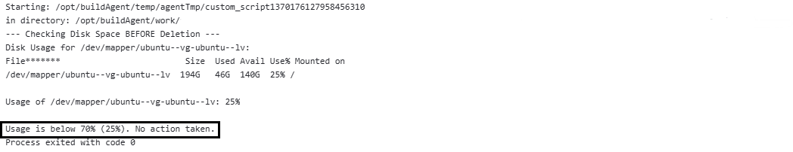
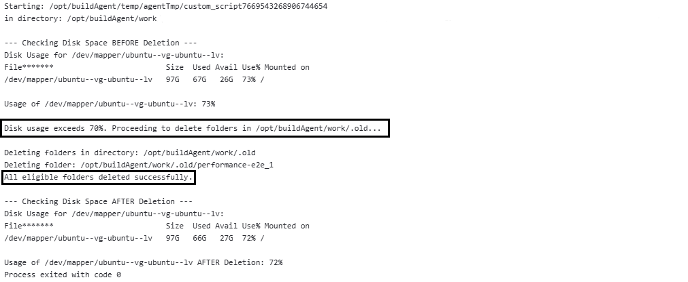

# Disk-Usage-Auto-Cleanup

## 1. Navigation
- [Reason for Creation](#2-reason-for-creation)
- [Feature Overview](#3-feature-overview)
- [Prerequisites](#4-prerequisites)
- [Installation and Execution](#5-installation-and-execution)
- [What It Does](#6-what-it-does)
- [Limitations](#7-limitations)
- [Output](#8-output)

---

## 2. Reason for Creation

I created this script because I often faced **disk space issues** on my Linux build agents.  
Every time the disk filled up, I had to **SSH into the agent manually**, search for unused folders, and delete them — which was **time-consuming and repetitive**.

To automate this, I wrote a Python script and integrated it into my **CI/CD build step**, so the cleanup happens automatically without manual intervention.

### Short Summary of the Project
A Python script that checks filesystem usage and automatically deletes a target directory when disk space usage exceeds 70%. It prints disk space before and after cleanup, and takes no action if usage is below the threshold.

---

## 3. Feature Overview
- Checks filesystem usage on Linux.
- Deletes the specified directory only if usage exceeds 70%.
- Prints "Disk Space BEFORE Deletion" and "Disk Space AFTER Deletion".
- Skips deletion when usage is normal.
- Lightweight script suitable for CI/CD automation.
- Helps prevent server build failures due to insufficient disk space.

---

## 4. Prerequisites

- Python 3 Installed  
   If Python is not installed, download it from: [https://www.python.org/downloads/](https://www.python.org/downloads/)

- dzdo/sudo Access  
   The agent user must have dzdo privileges to run the script with elevated permissions.

- Linux Environment  
   This script is intended to run on a Linux build agent or server.

---

## 5. Installation and Execution

1. Navigate to the directory where `cleanup_disk_space.py` is located.

2. Execute the script with dzdo and Python 3:

   ```PowerShell
   dzdo python3 cleanup_disk_space.py
   ```
---

## 6. What It Does

- Takes two variables:
  - `filesystem` → filesystem path to check
  - `targetdirectory` → directory to delete when usage is high
- Calls `get_filesystem_usage(filesystem)` to check the current disk usage.
- Prints **Disk Space BEFORE Deletion**.
- If usage is **greater than 70%**:
  - Deletes the folder inside `targetdirectory`.
  - Calls `get_filesystem_usage(filesystem)` again.
  - Prints **Disk Space AFTER Deletion**.
- If usage is **70% or below**, no deletion is performed.

---

## 7. Limitations

- The script supports **only one filesystem** and **one target directory** at a time.  
- Multiple target directories cannot be cleaned in a single run.  
- Deletion is permanent; ensure the `targetdirectory` is safe to remove.  
- Designed specifically for Linux environments; may not work on other OS.

---

## 8. Output

- **When Disk Space is Less Than 70%**
  
  


- **When Disk Space is More Than 70%**
  
  
